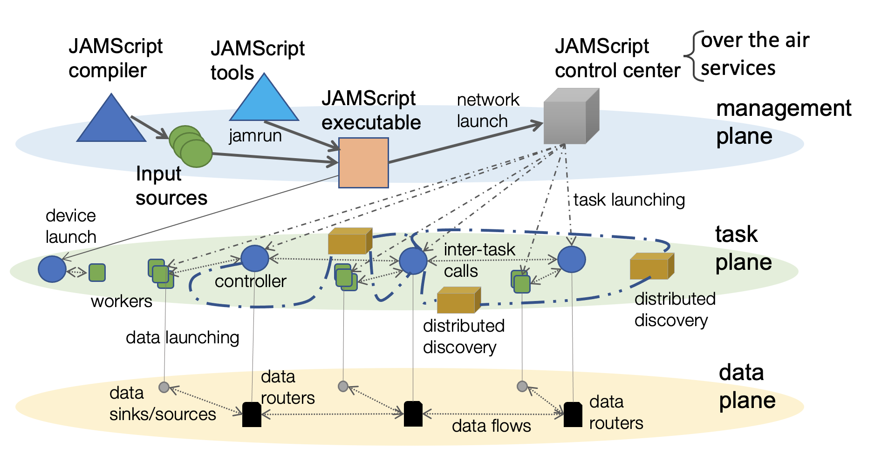

# JAMScript Over-the-Air Update Platform

This is the main repository for JAMScript's Over-the-Air (OTA) platform. Please see [README.md](https://github.com/michaelg29/JAMScript-OTA/blob/main/README.md) for startup instructions for local development and deployment.

The JAMScript ecosystem is summarized in the diagram below, with the control system at the top right. At a high level it receives requests from the user via the web portal to create networks, and then communicates with nodes for registration and task launching.

This repository houses a Docker container that represents a [control center](#control-center) running on a Linux machine. The control center serves as a hub to link users to their nodes without always needing to have a physical link to the nodes. There are several [tool programs](#tool-programs), that will be served to the nodes (edge devices), which act in conjunction with the JAMScript runtime. For persistence, the control center hosts a local [Redis database](./redis.md).

*Note: All protocol specification exists on the server documentation pages. Links are made from the corresponding socket client program pages.*

## Control center
There are four socket listeners running within the control center. The [web portal](./ota-portal/ota-portal.md) interfaces with user browsers and allows users to create and manage nodes. The [certificate server](./ota-portal/cert-server.md) sends the RSA public key (certificate) to nodes when they are ready to register. The [registration server](./ota-portal/reg-server.md) responds to node registration requests that originate with the nodes, and uses the RSA private key to decrypt the request body. Finally, the [state server](./ota-portal/state-server.md) responds to state change requests originating from nodes (i.e. coming online or going offline).

The control center also has runnable client programs which run on the server, and connect to listener programs running on nodes.

## Tool programs
The tools folder contains several client programs, which connect to and communicate with the certificate, registration, and state servers in the control center. They have different entry points, and will be run on the nodes that connect to the control center.
