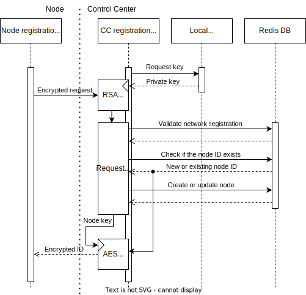

**Run on** | control center
**Program type** | listener
**Communicates with** | [Register Program](../tools/ijam-reg.md)
**Description** | Server to grant registration to nodes.

## Flow description
The registration server accepts registration requests from nodes, encrypted using the RSA public key granted by the [Certificate Server](./cert-server.md).
1. Receive request. Decrypt request using the RSA private key (specified in `$RSA_PKEY_PATH`).
1. Parse request as per [the schema](#decrypted-request-body). Ensure the network registration key is valid (checksum must be within a specific range).
1. Fetch the network object from the Redis database using the `networkId` from the request. Assert the registration key in the request belongs to the network. If either the network is not found or the keys do not match, return 404. Otherwise, delete the registration key from the database.
1. Determine the requesting user as the owner of the provided network.
1. If a non-empty node UUID was provided in the request, check if a node exists with the UUID. If a node does exist and belongs to the requesting user, validate the transition to offline. If a node exists, but does not belong to the user, generate a new UUID.
1. Update or create a node entry in the database under the requested or generated UUID. Pass the network ID, the owning user's username, a default name ("node"), and the node type and node key from the request.
1. Using the node key, send the node ID to the node as per [the Node Encryption Protocol](../node.md#responses-from-the-server-to-the-node).

## Schema description

### Decrypted request body

**Length**: 88 bytes

#### Fields

Bytes | Name | Description
-|-|-
[15:0] | nodeId | The UUID of the node. Empty if the server should generate one.
[31:15] | networkId | The UUID of the network to connect the node to.
[47:32] | networkPhrase | The passphrase for the network.
[79:48] | nodeKey | The encryption key to use for the node's communications (AES-256).
[83:80] | nodeType | The number representing the node type.
[87:84] | nodeArch | The node's architecture.

### Decrypted response

**Length**: 16 bytes

#### Fields

Bytes | Name | Description
-|-|-
[15:0] | nodeId | The UUID of the node created or updated.
