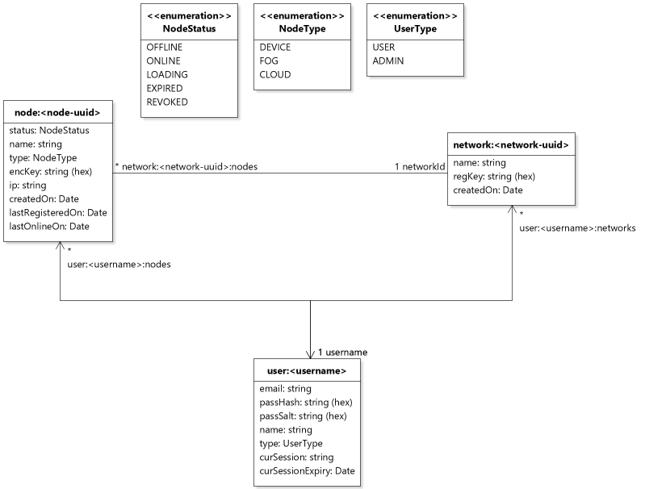
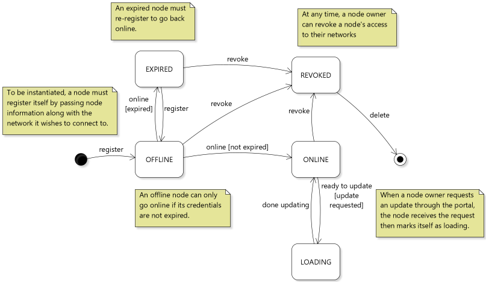

# Redis database

The control center hosts a local Redis database for persistence. There is a customized Node.JS client that is accessible by the listener programs on the control center.

## Domain model
The following image shows how the database is setup, with links between entries. Because Redis is non-relational, all the entries will be in the same space (like one big table), but they are grouped together in the diagram below for coherency.

### Nodes
Nodes can transition between states as shown below.

